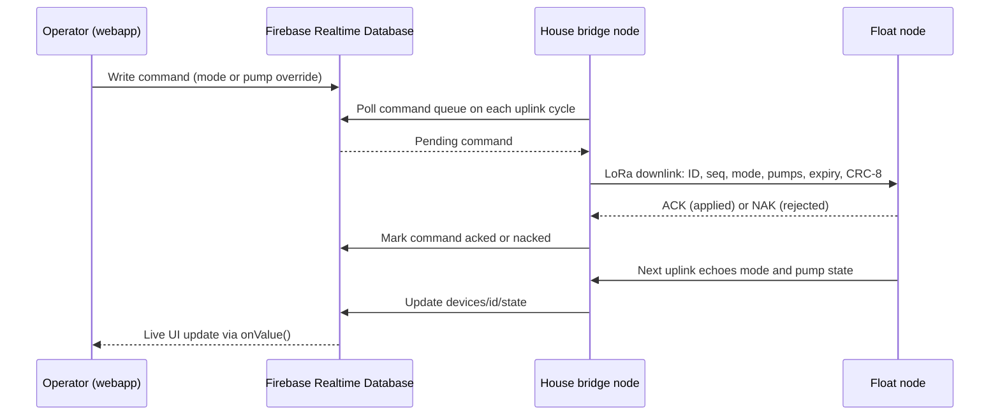

# Dashboard Application (APP) Specification

**Project:** Solar Automated LoRa-Integrated Mud Crab Aeration Network with Crab Grid Observation

The webapp is a **Next.js + Firebase Realtime Database + Auth** application on Vercel's free tier. It gives the farmer live monitoring, safe remote control (AUTO/MANUAL/OFF and per-pump overrides), and remote parameter editing — while the local selector remains the fail-safe ([`Components.md`](Components.md) — Control Interface).

## 1. Feature Set

| Area | Features |
|------|----------|
| Monitoring | Live DO, pH, salinity/EC, temperature ×2, mode, pump states, link quality (RSSI/SNR), last-seen time, stale-data banner |
| Control | AUTO / MANUAL / OFF mode selector, per-pump overrides in MANUAL, ACK/NAK feedback, MANUAL revert countdown |
| Parameters | Threshold editor with range validation, written to the device config and relayed to the float on the next downlink |
| Alerts | DO emergency, threshold breach, heartbeat loss, sensor fault, command NAK/expired |
| History | Trimmed log in RTDB, 24 h / 7 d charts, CSV export for the thesis |
| Admin | Device registry, farmer/admin roles via Firebase Auth, calibration due-date reminders |

## 2. Realtime Database Schema

```
devices/
  <deviceId>/
    state/            # written by the house bridge from each uplink
      mode: "AUTO" | "MANUAL" | "OFF"
      pumps: { air1, air2, bilge1, bilge2 }
      do, ph, ec, temp1, temp2        # scaled values
      rssi, snr, seq, emergency, sensorFault
      lastSeen: <serverTimestamp>
    config/
      device/    { name, location, radio: { freq, sf, bw, cr } }
      thresholds/ { doEmergency, doTarget, salMin, salMax, phMin, phMax,
                    tempMin, tempMax, manualRevertMin, aerationOn, aerationOff }
      calibration/ { phDue, ecDue, doDue }     # ISO dates, drives reminders
commands/
  <deviceId>/
    queue/<pushKey>/
      cmdId, mode, pumpBitmap, expiryMs, issuedBy, issuedAt
      status: "pending" | "sent" | "acked" | "naked" | "expired"
logs/
  <deviceId>/<timestamp>/   # trimmed history; the UI offers CSV export
users/
  <uid>/ { name, role: "farmer" | "admin" }
```

## 3. Pages

1. **Dashboard** — live cards for every value in `state/`; a STALE banner when `lastSeen` is older than 90 s (heartbeat-loss rule, [`FIRMWARE.md`](FIRMWARE.md) §6).
2. **Control** — mode selector with confirmations; per-pump switches enabled only in MANUAL; each command shows its ACK/NAK result and expiry; MANUAL shows a live revert countdown.
3. **Parameters** — threshold editor (§6 validation table); writes land in `config/thresholds` with `issuedBy` + timestamp, and the bridge relays them as a config downlink; firmware clamps values again (defense in depth).
4. **Alerts** — alert list and history; in-app banners now, email/SMS hooks later.
5. **History** — charts (24 h / 7 d) from `logs/`, CSV export for the thesis charts.
6. **Devices** — registry and roles; admins manage devices and users.
7. **Camera** — instructions to join the camera's WiFi AP (`crabcam-<id>`) during pond visits; the camera is WiFi-only by design and never streams over LoRa.

## 4. Command Flow



Command latency is one uplink cycle (≤ 60 s); DO emergencies bypass the schedule entirely ([`FIRMWARE.md`](FIRMWARE.md) §5–6).

## 5. Safety Interlocks

| Interlock | Behavior |
|-----------|----------|
| Aeration lock | Aeration cannot be fully disabled while DO is below `doEmergency` — rejected in the UI, re-checked in firmware |
| OFF confirmation | OFF requires a typed confirmation warning that crabs must not be stocked |
| MANUAL revert | MANUAL auto-reverts to AUTO after `manualRevertMin` without a fresh command (default 5 min); the UI shows the countdown |
| Command expiry | Every command carries an expiry; stale commands are NAKed |
| Fail-safe default | Boot, reset, or link loss → AUTO with aeration ON |
| Local authority | The physical selector overrides the dashboard at the device |

## 6. Threshold Validation Ranges

| Parameter | Default | Allowed range | Unit |
|-----------|---------|---------------|------|
| `doEmergency` | 3.0 | 2.0–4.0 | ppm |
| `doTarget` | 5.0 | 4.0–7.0 | ppm |
| `salMin` | 28 | 10–34 | ppt |
| `salMax` | 32 | 10–34 (must exceed `salMin`) | ppt |
| `phMin` | 7.5 | 6.5–8.5 | pH |
| `phMax` | 8.5 | 7.0–9.0 (must exceed `phMin`) | pH |
| `tempMin` | 27 | 20–33 | °C |
| `tempMax` | 30 | 22–35 (must exceed `tempMin`) | °C |
| `manualRevertMin` | 5 | 1–30 | min |
| `aerationOn` / `aerationOff` | 18:00 / 06:00 | HH:MM | optional night schedule |

## 7. Alerts

| Alert | Trigger | Path |
|-------|---------|------|
| DO emergency | `state.do < doEmergency` | Immediate emergency uplink flag; red banner; logged |
| Threshold breach | Any value outside its band for two consecutive uplinks | Banner + alert history |
| Heartbeat loss | No uplink for 90 s | Bridge local alarm **and** dashboard banner — the bridge alarms even when the internet is down |
| Sensor fault | `state.sensorFault` bit or impossible values | Banner + history |
| Command NAK/expired | `commands/.../status` | Shown next to the command |

## 8. Non-Functional Requirements

1. **Free tier budget:** keep live state in one node, trim `logs/<id>` (e.g., last 7 days) so RTDB stays inside the Spark plan.
2. **Security:** Auth-only database rules ([`SETUP.md`](SETUP.md) §5); the service-account key exists only server-side as Vercel env vars — never in client code.
3. **Offline behavior:** if the house internet drops, the dashboard goes stale but the bridge keeps alarming locally and the float keeps running AUTO.
4. **Auditability:** every command and threshold edit records `issuedBy` and a timestamp for the thesis log.
