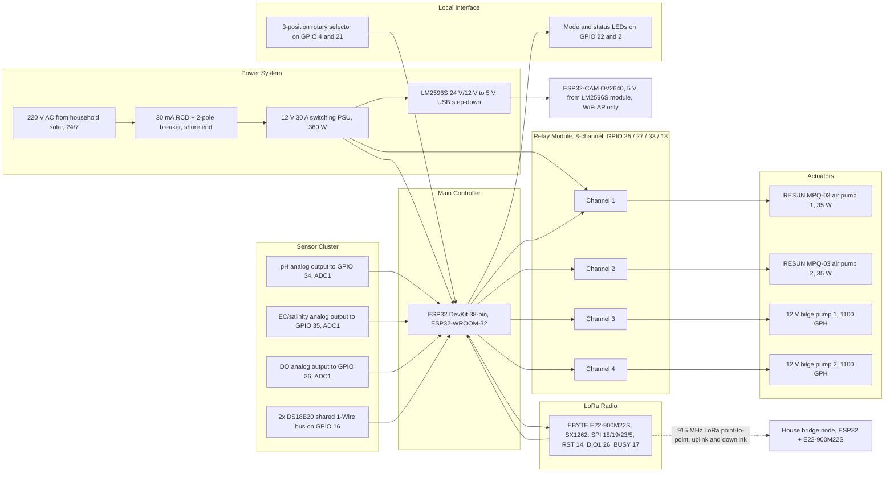

# Hardware Block Diagram

**Project:** Solar Automated LoRa-Integrated Mud Crab Aeration Network with Crab Grid Observation

This document presents the hardware block diagram in the format required for the undergraduate thesis manuscript. It shows the float node's power chain, controller, sensor cluster, LoRa radio, relay-driven actuators, and local interface, plus the radio link to the house bridge. Pin numbers follow the verified map in [`WIRING.md`](WIRING.md) §3.

## 1. Block Diagram

**Figure 1.** Hardware block diagram of the float node and its link to the house bridge.

## 2. Block Descriptions

| Block | Function | Key interfaces |
|-------|----------|----------------|
| Power system | 220 V AC from the household solar installation, protected by a shore-end 30 mA RCD, converted to 12 V DC and 5 V DC | Licensed-electrician AC side; 12 V feeds pumps, relays and controller; 5 V feeds the camera |
| Main controller | ESP32-WROOM-32 runs the automation logic, LoRa protocol, and fail-safe rules | Three ADC1 analog inputs, 1-Wire, VSPI to the radio, four relay outputs |
| Sensor cluster | DO, pH, EC/salinity, and two temperature probes | Analog on GPIO 34/35/36 (ADC1); DS18B20 pair on GPIO 16 with a 4.7 kΩ pull-up |
| LoRa radio | EBYTE E22-900M22S (SX1262) at 915 MHz | SPI 18/19/23, NSS 5, RST 14, DIO1 26, BUSY 17; 3.3 V logic only |
| Relay module | 8-channel, 12 V coil, optocoupler, low-level trigger; four channels used, four spare | External 10 kΩ pull-ups hold relays OFF through boot and reset |
| Actuators | Two RESUN MPQ-03 air pumps (N+1 alternating duty) and two bilge pumps | Branch-fused 12 V feeds; per-cage valves on the water header |
| Local interface | 3-position AUTO/OFF/MANUAL selector and status LEDs | Active-LOW decode on GPIO 4/21; LEDs on GPIO 22/2 |
| Camera node | ESP32-CAM OV2640 for overhead visual monitoring | WiFi AP during pond visits; never streams over LoRa |
| House bridge | Second ESP32 + E22 at the house | Relays LoRa ↔ Firebase in both directions |

## 3. Design Notes

1. All analog sensors sit on **ADC1** so the pin map stays valid even if WiFi is later enabled on a node ([`WIRING.md`](WIRING.md) §4).
2. No actuator is connected to a boot-strapping pin; GPIO 0, 12, 15 and UART0 pins 1/3 remain unconnected.
3. The relay module's low-level trigger is boot-safe: firmware drives the GPIOs HIGH before initialization and external pull-ups keep the inputs released during reset.
4. The pipe grid carries the air and water headers as separate circuits; it is conduit, never flotation ([`Components.md`](Components.md) — Floaters).
