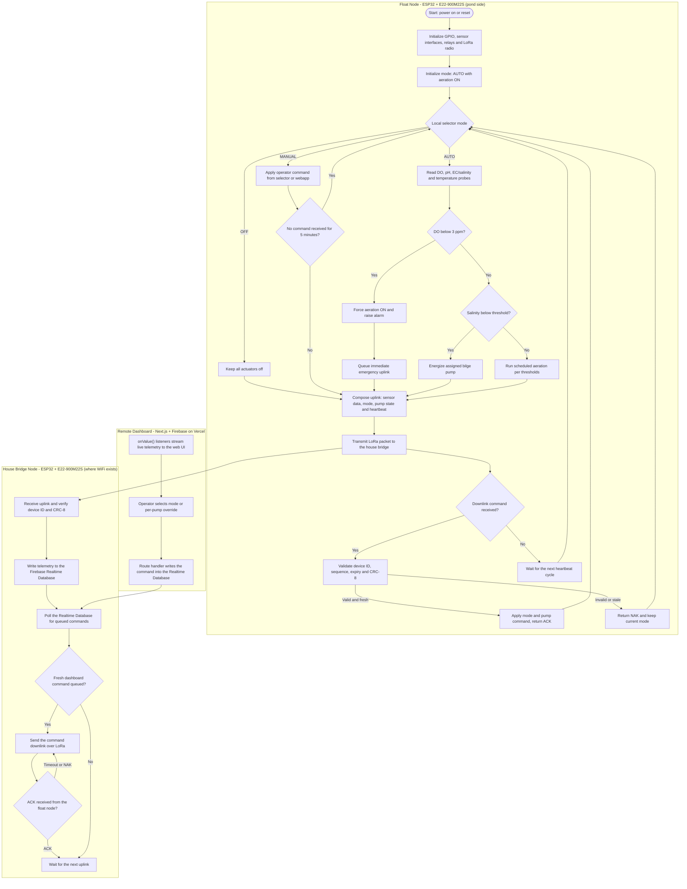

# System Flowchart

**Project:** Solar Automated LoRa-Integrated Mud Crab Aeration Network with Crab Grid Observation

This document presents the operational flowchart of the system in the format required . It traces one complete control cycle: sensor acquisition and automatic first-aid logic at the float node, LoRa transmission to the house bridge node, telemetry storage in Firebase, dashboard command relay, and the fail-safe mode rules enforced by the firmware ([`FIRMWARE.md`](FIRMWARE.md) §2).

## 1. Flowchart

**Figure 1.** Overall operational flowchart of the Solar Automated LoRa-Integrated Mud Crab Aeration Network.

## 2. Flow Description

1. **Initialization.** On power-up or reset the node forces mode AUTO with aeration ON — the fail-safe default ([`FIRMWARE.md`](FIRMWARE.md) §2).
2. **Mode selection.** The local selector decodes AUTO, MANUAL, or OFF ([`WIRING.md`](WIRING.md) §6). OFF exists for servicing only.
3. **Automatic first aid.** In AUTO the firmware reads dissolved oxygen, pH, EC/salinity, and temperature. DO below 3 ppm overrides every mode, forces aeration, and triggers an immediate emergency uplink.
4. **Salinity logic.** A sub-threshold salinity run engages the assigned bilge pump for flushing or controlled brine testing; open-water salinity correction is not claimed ([`Components.md`](Components.md) — Water circulation).
5. **Uplink.** Every cycle composes one frame — sensor data, mode, pump state, heartbeat — transmitted over 915 MHz LoRa point-to-point.
6. **Downlink handling.** Commands are accepted only when the device ID, sequence, expiry window, and CRC-8 all validate; otherwise the float returns a NAK and keeps its current mode.
7. **Bridge and cloud.** The house bridge verifies each uplink, writes telemetry to the Realtime Database, relays queued dashboard commands downlink, and tracks ACK/NAK results.
8. **Dashboard.** `onValue()` listeners stream the live state to the web UI; operator commands enter the Realtime Database queue ([`APP.md`](APP.md) §4).

## 3. Fail-Safe Notes

- MANUAL auto-reverts to AUTO after 5 minutes without a fresh command.
- Heartbeat loss beyond 90 s raises an alarm at the house bridge.
- The physical selector always overrides dashboard intent at the device.
