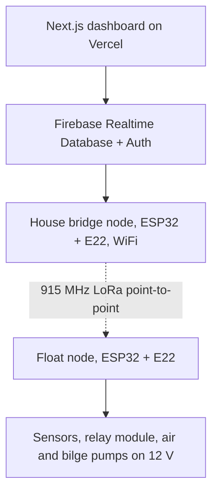

# Technology Stack

**Project:** Solar Automated LoRa-Integrated Mud Crab Aeration Network with Crab Grid Observation

A layer-by-layer reference of every technology the system uses, from the pond hardware to the hosted dashboard. Selection rationale and validation notes live in [`Components.md`](Components.md); the architecture view is in [`SYSTEM-ARCHITECTURE.md`](SYSTEM-ARCHITECTURE.md).

## 1. Stack at a Glance

**Figure 1.** Technology stack, from the hosted dashboard down to the pond hardware.

## 2. Hardware Stack

| Layer | Component | Qty | Role |
|-------|-----------|-----|------|
| Edge controller | ESP32 DevKit 38-pin (ESP32-WROOM-32) | 3 (float, bridge, spare/dev) | Runs control logic and the LoRa link |
| Radio | EBYTE E22-900M22S (SX1262, 915 MHz) | 3 | Long-range point-to-point telemetry |
| Observation | ESP32-CAM (OV2640) | 1 | Overhead visual monitoring over a WiFi AP |
| Sensing | DFRobot EC K=10, pH E-201-C + PH-4502C, DS18B20 ×2, DO SEN0237-A | 1 ea (temp ×2) | Water-quality measurement |
| Actuation | 8-channel relay, 2 × RESUN MPQ-03 air pumps, 2 × bilge pumps 1100 GPH | 1 set | Aeration and circulation |
| Power | 220 V AC drop + 30 mA RCD, 12 V 30 A PSU, LM2596S 5 V module | 1 set | Household-solar-fed power chain |
| Structure | 8 slotted fattening boxes, foam pontoons, PVC air/water grid, sensor hub | 1 set | Floating cage grid on the pond |

## 3. Firmware Stack

| Technology | Used by | Purpose |
|------------|---------|---------|
| Arduino framework on ESP32 (Arduino IDE or PlatformIO) | all nodes | Build system and runtime |
| `RadioLib` | float, bridge | SX1262 driver for the E22-900M22S |
| `OneWire` + `DallasTemperature` | float | DS18B20 probes |
| `DFRobot_EC` / `DFRobot_pH` | float | EC and pH conversion with calibration |
| `Firebase Arduino Client Library` (Mobizt) | bridge | Realtime Database writes |
| NVS/EEPROM storage | float | Calibration constants and config persistence |

Protocol details (frames, CRC-8, ACK/NAK, heartbeat) are specified in [`FIRMWARE.md`](FIRMWARE.md) §5.

## 4. Communication Stack

| Link | Technology | Notes |
|------|------------|-------|
| Pond ↔ house | LoRa point-to-point, 915 MHz (E22/SX1262), SF9, BW 125 kHz, CR 4-5, private sync word | Philippine NTC licence-free SRD band; confirm measured EIRP and type-approval |
| House ↔ cloud | Home WiFi via the bridge node | The only internet-dependent hop |
| Phone ↔ camera | WiFi AP (`crabcam-<id>`) | Pond-visit monitoring; video never traverses LoRa |
| Packet integrity | Device ID, sequence, expiry, CRC-8, ACK/NAK, 60 s heartbeat | Defined in [`FIRMWARE.md`](FIRMWARE.md) §5 |

## 5. Backend Stack

| Technology | Role |
|------------|------|
| Firebase Realtime Database | Live telemetry (`devices/<id>/state`), command queue, trimmed logs |
| Firebase Auth (Email/Password) | Farmer and admin accounts; Auth-only database rules |
| Service account (Vercel env vars) | Server-side database access; key never shipped to the client |

Schema: [`APP.md`](APP.md) §2.

## 6. Frontend Stack

| Technology | Role |
|------------|------|
| Next.js (React) | Dashboard UI: monitoring, control, parameters, alerts, history |
| Vercel Hobby tier | Free hosting with the four Firebase env vars |
| RTDB `onValue()` listeners | Live streaming state into the UI |

Feature specification and safety interlocks: [`APP.md`](APP.md) §1 and §5.

## 7. Development and Documentation Tools

| Tool | Use |
|------|-----|
| Arduino IDE / PlatformIO | Firmware builds and flashing |
| Git + GitHub | Version control; tagged field deployments |
| Node.js LTS | Dashboard development and build |
| Mermaid | Thesis diagrams ([`FLOWCHART.md`](FLOWCHART.md), [`SYSTEM-ARCHITECTURE.md`](SYSTEM-ARCHITECTURE.md), [`BLOCK-DIAGRAM.md`](BLOCK-DIAGRAM.md), Figure 1 above) |
| Markdown documentation set | Builder guides: [`SETUP.md`](SETUP.md), [`WIRING.md`](WIRING.md), [`TESTING.md`](TESTING.md), [`CALIBRATION.md`](CALIBRATION.md), [`TROUBLESHOOTING.md`](TROUBLESHOOTING.md) |

## 8. Explicit Non-Dependencies

1. **No LoRaWAN server** (TTN/ChirpStack) — the link is plain point-to-point to the house bridge.
2. **No on-site solar panels, MPPT, or battery** — power comes from the household's existing 24/7 solar-backed installation.
3. **No paid hosting** — Firebase Spark and Vercel Hobby free tiers cover the project scale.
