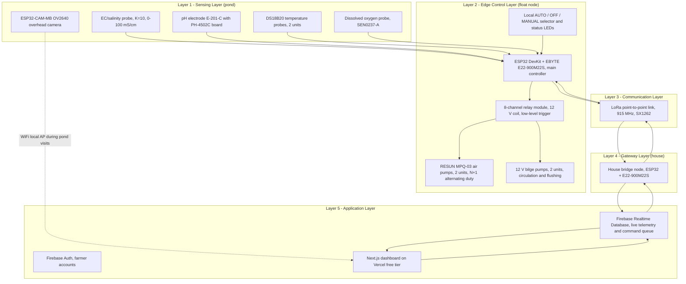

# System Architecture

**Project:** Solar Automated LoRa-Integrated Mud Crab Aeration Network with Crab Grid Observation

This document describes the system architecture in the format required . The system is organized into five layers, from pond-side sensing to the cloud-hosted dashboard, connected by a 915 MHz LoRa point-to-point link where no WiFi exists.

## 1. Architecture Diagram

**Figure 1.** Five-layer system architecture of the automated aeration network.

## 2. Layer Descriptions

| Layer | Contents | Responsibility |
|-------|----------|----------------|
| 1 — Sensing | EC/salinity, pH, DO, 2 × DS18B20, overhead camera | Continuous water-quality measurement at mid-depth on a centred, removable hub |
| 2 — Edge control | ESP32 + E22, 8-channel relay, air pumps (N+1), bilge pumps, local selector | Runs the automation logic and first-aid rules autonomously; WiFi stays off |
| 3 — Communication | 915 MHz LoRa point-to-point (SX1262) | Uplinks telemetry and heartbeats; downlinks commands; no LoRaWAN server |
| 4 — Gateway | House bridge node (ESP32 + E22) where WiFi exists | Relays LoRa ↔ Firebase both directions; alarms on heartbeat loss |
| 5 — Application | Firebase Realtime Database + Auth; Next.js dashboard on Vercel | Live monitoring, control, parameter management, alerts, history ([`APP.md`](APP.md)) |

## 3. Data Flow

| Direction | Path | Contents |
|-----------|------|----------|
| Uplink (≤ 60 s heartbeat) | Sensors → float node → LoRa → bridge → RTDB → dashboard | Scaled DO, pH, EC, temperatures, mode, pump bitmap, flags |
| Emergency uplink (immediate) | Same path | DO below 3 ppm bypasses the schedule with the emergency flag |
| Downlink (next uplink cycle) | Dashboard → RTDB → bridge → LoRa → float node | Mode command, pump overrides, threshold/config updates; ID + seq + expiry + CRC-8 validated |
| Local (no cloud) | Selector → float node | AUTO/MANUAL/OFF fail-safe control independent of any network |

## 4. Design Rationale

1. **Autonomy first.** The pond has no grid, no WiFi, and no operator on site; the float node must keep crabs alive alone — hence fail-safe AUTO, 5-minute MANUAL revert, and aeration ON at boot.
2. **Point-to-point over LoRaWAN.** A single pond-to-house link needs no gateway subscription; the house bridge is the only WiFi-capable radio node.
3. **Separation of concerns.** Sensing, control, communication, gateway, and application layers can each be tested and replaced independently (see [`TESTING.md`](TESTING.md) gates).
4. **Single points of failure are watched.** The DO probe (one unit) has a documented handheld-meter fallback; the AC drop (no on-site battery) is watched by the bridge's heartbeat-loss alarm.
5. **Compliance gates.** 915 MHz operation respects the Philippine NTC licence-free SRD band; the 220 V AC drop is a licensed-electrician installation under the Philippine Electrical Code.
